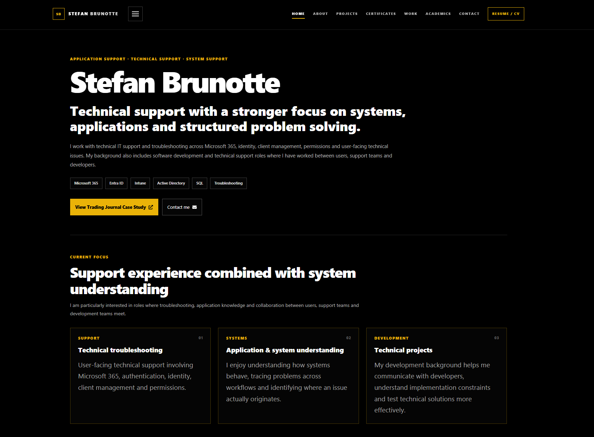

# Stefan Brunotte Portfolio

Personal portfolio focused on technical support, system support and software projects.

The site presents my professional background, technical skills, certifications and selected projects, with a particular focus on the intersection between support, systems, troubleshooting and practical technical development.

## Live portfolio

https://mrbrunotte.github.io/stefanbrunotteportfolio/

## Current focus

I currently work with technical IT support and administration in areas including:

- Microsoft 365
- Microsoft Entra ID
- Active Directory
- Intune
- Outlook and OneDrive
- MFA and authentication
- Windows client management
- Permissions and user administration
- Technical troubleshooting and escalation

My target roles include:

- Application Support
- Technical Support
- System Support
- Application Specialist

## Featured technical project

### MrBrunotte's Trading Journal

An ongoing local-first desktop application project focused on structured trade review, analytics, workflow design and reusable behavioral history.

I own the product requirements, workflows, system behavior, prioritization, testing, validation and development decisions. ChatGPT is used as the coding implementation layer.

The public case study covers areas such as:

- CSV import and normalization
- Data modelling
- Multi-account execution handling
- Review workflows
- Analytics
- Local persistence with SQLite
- Backup and restore
- Rule- and data-driven behavioral analysis
- Refactoring and maintainability

**Public case study:**  
https://trading-journal-case-study.netlify.app/

## Portfolio technology

The portfolio itself is built with:

- React
- JavaScript
- HTML
- CSS
- GitHub Pages
- EmailJS
- React Toastify

## Other technical experience

My background also includes software development and web projects using technologies such as:

- React
- JavaScript
- TypeScript
- C#
- .NET
- SQL
- Git
- GitHub
- WordPress

## Purpose of this repository

This repository contains the source code for my personal portfolio website.

The portfolio is intended to provide a concise overview of my professional experience, technical background and selected projects for recruiters, hiring managers and technical teams.

## Contact

**LinkedIn:**  
https://www.linkedin.com/in/stefanbrunotte/

**GitHub:**  
https://github.com/MrBrunotte

**Trading Journal Case Study:**  
https://trading-journal-case-study.netlify.app/
